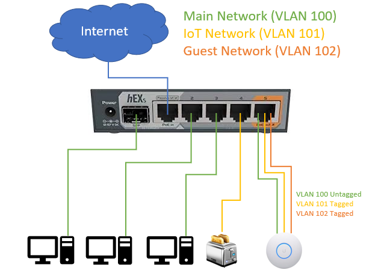

# >>> IN PROGRESS DO NOT USE <<<

## Secure Mikrotik Router Hex S RB760iGS for Home Office Use
_**Disclaimer:** These are personal notes for config and there are no guarantees of security after applying these config settings._

## Home Office Network Design



This network design assumes the following
- Port 1 Wide Area Network (WAN) connected to ISP/Modem
- Port 5 Access Point (AP) for WiFi
- Three separate networks seperated with VLANs
  - Main Network 192.168.100.0/24 - VLAN 100 (for user devices like laptop and phones)
    - Ports 3-4
    - Port 5 (with connected wifi access point)
  - Device/IoT Network 192.168.101.0/24 - VLAN 101 (for internet enabled devices that are not as secure like wifi power switches, sensors etc)
    - Port 5 (with connected wifi access point)
  - Guest Network 192.168.102.0/24
    - Port 5 (with connected wifi access point)
    
## Start with a reset
 - It is assumed that you have reset the router to the default configuration.
 - To reset the router remove power, press and continue to hold the reset button in until the sfp port light comes on and then begins to flash, then release the reset button. OR run '/system reset-configuration'

## Setup Script

```
#Setup VLANs
/interface vlan
add interface=bridge name=main-vlan vlan-id=100
add interface=bridge name=iot-vlan vlan-id=101
add interface=bridge name=guest-vlan vlan-id=102

/interface list
add VLAN

/interface list member
add interface=main-vlan list=VLAN
add interface=iot-vlan list=VLAN
add interface=guest-vlan list=VLAN

# Setup bridge default pvid
#/interface bridge
#set pvid=100 [find name="bridge"]

# Ingress Behavior
/interface bridge port
set pvid=100 frame-types=admit-only-untagged-and-priority-tagged [find bridge=bridge]
set pvid=101 [find interface=ether4]
set frame-types=admit-all [find interface=ether5]

# Egress Behaviour
/interface bridge vlan
add bridge=bridge tagged=bridge untagged=ether2,ether3,ether5,sfp1 vlan-ids=100 comment="main-vlan"
add bridge=bridge untagged=ether4 tagged=bridge,ether5 vlan-ids=101 comment="iot-vlan"
add bridge=bridge tagged=bridge,ether5 vlan-ids=102 comment="guest-vlan"

/


# IP Setup
/ip pool
add name=main-pool ranges=192.168.100.10-192.168.100.254
add name=iot-pool ranges=192.168.101.10-192.168.101.254
add name=guest-pool ranges=192.168.102.10-192.168.102.254

/ip address
#set interface=main-vlan comment="" [find interface=ether2]
#set interface=bridge comment="" [find interface=ether2]
add address=192.168.100.1/24 interface=main-vlan
add address=192.168.101.1/24 interface=iot-vlan
add address=192.168.102.1/24 interface=guest-vlan

/ip dhcp-server network
#set comment=main-dhcp-network [find comment=defconf]
add address=192.168.100.0/24 gateway=192.168.100.1 comment="main-dhcp-network"
add address=192.168.101.0/24 gateway=192.168.101.1 comment="iot-dhcp-network" 
add address=192.168.102.0/24 gateway=192.168.102.1 comment="guest-dhcp-network"

/ip dhcp-server
add address-pool=main-pool interface=main-vlan disabled=no name=main-dhcp
add address-pool=iot-pool interface=iot-vlan disabled=no name=iot-dhcp
add address-pool=guest-pool interface=guest-vlan disabled=no name=guest-dhcp
remove [find name=defconf]

# enable vlan filtering
/interface bridge
set vlan-filtering=yes [find name="bridge"]

/


# Clear and re-set the firewall for ease of ordering
/ip firewall filter
remove [find chain="input"]
remove [find chain="forward"]

/ip firewall filter
#Input Chain
add action=accept chain=input comment="defconf: accept established,related,untracked" connection-state=established,related,untracked
add action=drop chain=input comment="defconf: drop invalid" connection-state=invalid
add chain=input action=accept in-interface-list=VLAN comment="Allow VLAN access to router services"
add chain=input action=accept in-interface=main-vlan comment="Allow main-vlan access to router services"
add chain=input action=drop comment="Drop all other traffic" 
#Forward Chain
add chain=forward action=accept comment="defconf: accept in ipsec policy" ipsec-policy=in,ipsec
add chain=forward action=accept comment="defconf: accept out ipsec policy" ipsec-policy=out,ipsec
add action=fasttrack-connection chain=forward comment="defconf: fasttrack" connection-state=established,related
add action=accept chain=forward comment="defconf: accept established,related, untracked" connection-state=established,related,untracked
add action=accept chain=forward connection-state=new in-interface-list=VLAN out-interface-list=WAN "VLAN Internet Access Only"
add action=drop chain=forward comment="defconf: drop invalid" connection-state=invalid
add action=drop chain=forward comment="defconf: drop all from WAN not DSTNATed" connection-nat-state=!dstnat connection-state=new in-interface-list=WAN

### TODO Setup the time


########
#Security
########

# Setup a new administrative account
/user add name=YOUR_UNIQUE_NAME password=YOUR_STRONG_PASSWORD group=full
/user remove admin

# Disable all the configuration methods except ssh (If you prefer winbox you will need to change as appropriate)
/ip service enable ssh
/ip service disable telnet,ftp,www,www-ssl,api,api-ssl,winbox
#TODO disable MAC services

```

TODO
- Automatic updates


- Denial of Service (DoS) Protection
Mikrotik DoS Attack Protection https://wiki.mikrotik.com/wiki/DoS_attack_protection
Mikrotik DDos Detection and Blocking https://wiki.mikrotik.com/wiki/DDoS_Detection_and_Blocking

- Firewall
- Intrusion Detection System (IDS) or Intrusion Prevention System


## General References:

- [Mikrotik: How to configure a home router](https://wiki.mikrotik.com/wiki/How_to_configure_a_home_router)
- [Mikrotik: Securing Your Router](https://wiki.mikrotik.com/wiki/Manual:Securing_Your_Router)
- [Mikrotik Help: Webfig - Enable HTTPS](https://help.mikrotik.com/docs/display/ROS/Webfig)
- [Murray's Blog: Use a Mikrotik as Your Home Router](https://blog.ligos.net/2017-02-16/Use-A-Mikrotik-As-Your-Home-Router.html)
- [Mikrotik Forums: pcunite - Using RouterOS to VLAN](https://forum.mikrotik.com/viewtopic.php?t=143620)
